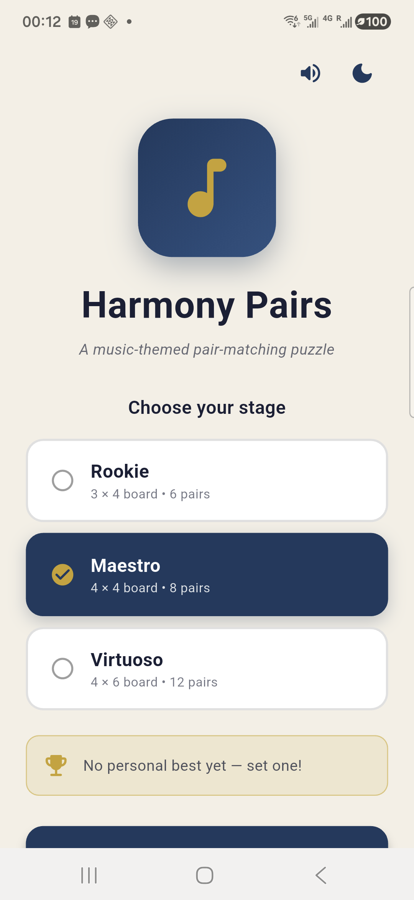
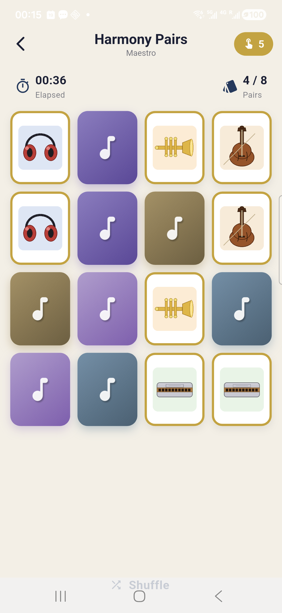
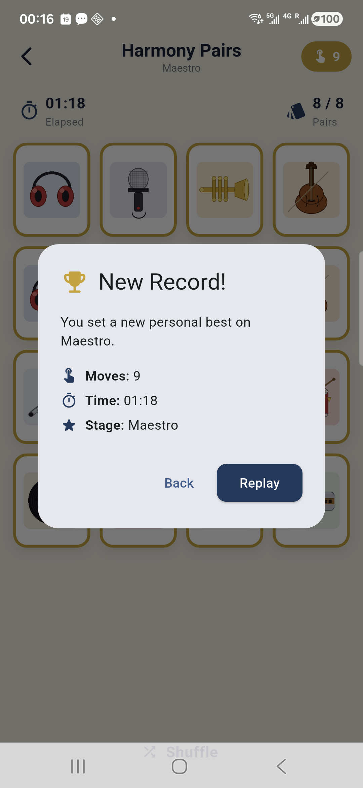

# 🎵 Harmony Pairs

> A music-themed pair-matching puzzle built with Flutter / Dart

[](https://flutter.dev)
[](https://dart.dev)
[](#)
[](#)

A pair-matching ("Memory") game where the player flips two tiles per turn looking for matching musical instruments. Built as Exercise 2 for **COMP-5450 Mobile Programming** at Lakehead University.

---

## 📸 Screenshots

| Launch Screen | Active Gameplay | Victory Dialog |
|:---:|:---:|:---:|
|  |  |  |
| Stage picker + best-score card | 4×4 board, Maestro stage | New personal best! |

---

## ✨ Features

- 🎚️ **Three difficulty stages** — Rookie (3×4 / 6 pairs), Maestro (4×4 / 8 pairs), Virtuoso (4×6 / 12 pairs)
- 🎸 **12 custom instrument tiles** — guitar, piano, drum, violin, saxophone, trumpet, microphone, harmonica, flute, headphones, vinyl, music note
- 🔄 **3D flip animation** — Y-axis rotation with perspective transform
- 🏆 **Persistent best scores** — each stage tracks fewest moves (time tiebreaker), survives app restarts
- 🌙 **Light & dark themes** — toggle from the launch screen, choice is persisted
- 🔊 **Sound + haptic feedback** — click on flip, light tap on match, heavier tap on mismatch, celebratory pattern on victory
- 🎉 **Victory dialog** — distinguishes "New Record!" from "Bravo!"
- 🎨 **Classical-music palette** — deep navy primary, brass-gold accent, paper-cream / midnight backdrops

---

## 🛠️ Tech Stack

- **Flutter 3.10+** / **Dart 3.0+** — primary framework
- **Material 3** — theming and design system
- **shared_preferences** — best-score and theme persistence
- **HapticFeedback + SystemSound** — tactile feedback (no third-party audio package needed)

---

## 📁 Project Structure

```
harmony_pairs/
├── lib/
│   ├── main.dart                   # App entry point & MaterialApp
│   ├── theme/
│   │   └── app_palette.dart        # Color tokens (navy + brass)
│   ├── models/
│   │   ├── tile.dart               # Tile + TileStatus enum
│   │   ├── stage.dart              # Difficulty descriptor
│   │   └── score_record.dart       # Best-score entry
│   ├── services/
│   │   ├── preferences_store.dart  # SharedPreferences wrapper
│   │   └── sound_engine.dart       # SystemSound + HapticFeedback
│   ├── screens/
│   │   ├── launch_screen.dart      # Title + stage picker
│   │   └── board_screen.dart       # Gameplay + victory dialog
│   └── widgets/
│       └── tile_card.dart          # 3D flip-animation widget
├── assets/images/                  # 12 instrument PNG tiles
├── screenshots/                    # README screenshots
├── android/                        # Android platform files
├── web/                            # Chrome / Web platform files
├── pubspec.yaml
└── README.pdf                      # Full project report
```

---

## 🚀 Getting Started

### Prerequisites

- Flutter SDK 3.10 or newer
- Android Studio (latest) **or** VS Code with the Flutter extension
- Android SDK (API 21+) for Android builds
- Chrome for the web target

### Run on Android

```bash
git clone https://github.com/donaldabc001/harmony_pairs.git
cd harmony_pairs
flutter pub get
flutter run
```

### Run on Web

```bash
flutter run -d chrome
```

### Build a release APK

```bash
flutter build apk --release
# Output: build/app/outputs/flutter-apk/app-release.apk
```

---

## 🎮 How to Play

1. Open the app — you land on the **Launch screen**.
2. Toggle 🔊 sound and 🌙 dark mode from the top-right.
3. Pick a stage (Rookie / Maestro / Virtuoso).
4. Tap **Begin** — the board shuffles and the timer starts.
5. Tap two hidden tiles per turn looking for a matching pair.
6. Matched pairs lock face-up with a brass ring.
7. Mismatched pairs flip back after ~0.9 seconds.
8. Beat your previous best to unlock the **"New Record!"** badge.

---

## 📋 Implementation Notes

- **Card flip** — `AnimationController` tweens an angle from 0 to π with `easeInOutCubic`. The composite transform sets a perspective entry (`Matrix4..setEntry(3, 2, 0.0012)`) and rotates around the Y axis. After π/2 the front face is rendered, mirrored horizontally so the artwork reads correctly.
- **Deck assembly** — For C×R tiles, the controller picks N = (C×R)/2 shuffled instruments, creates two Tile instances per instrument with the same `groupKey`, then shuffles for randomized seat positions.
- **Match resolution** — Two tiles in the `revealed` state trigger comparison. Matches → `locked`. Mismatches → board freezes, both flip back after 900ms.
- **Best scores** — JSON-serialized `ScoreRecord` per stage. "Better" = fewer moves; time breaks ties.

See [`README.pdf`](README.pdf) for the full project report with file-by-file documentation.

---

## 🛠️ Tools Used

This project was built with: Flutter SDK, Dart, Android Studio, Python (Pillow) for procedurally generating the 12 instrument tile illustrations, and an AI coding assistant for discussing code structure and accelerating boilerplate. All design choices (theme, palette, features, difficulty configuration), debugging, integration, and on-device testing were performed by the author.

---

## 👤 Author

**Chengbiao Qin** — Student ID 1269476
Lakehead University · Department of Computer Science
COMP-5450 Mobile Programming · Spring 2026 · Dr. Sabah Mohammed

---

## 📄 License

This project is submitted as coursework for COMP-5450 at Lakehead University. Educational use only.
